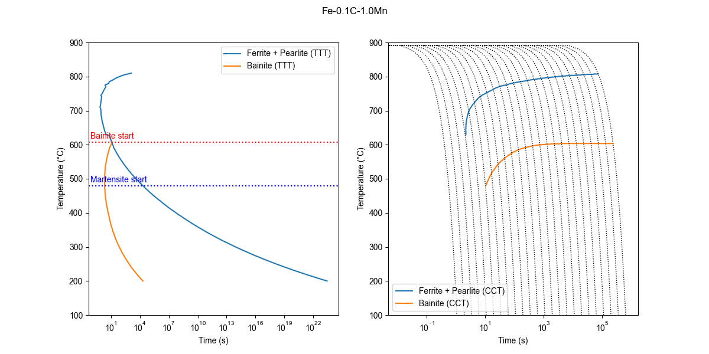

# About

[MUCG83](https://www.phase-trans.msm.cam.ac.uk/map/steel/programs/mucg83.html) is a software developed by Mathew Peet and H.K.D.H. Bhadeshia from the University of Cambridge for modelling the thermodynamics and kinetics of solid-state phase transformations in steels. The original software runs in a shell (command prompt) and the compositions have to be provided by manual input of the user, while the output is printed in the shell. The TTT diagrams can be plotted in a external software. This process can be quite boring. In order to solve this, the python script `mucg83_python_interface.py` in this repository provides a simple interface for generating TTT plots from the calculations performed in mucg83.

```bash
usage: mucg83_python_interface.py [-h] [-C C] [-Si SI] [-Mn MN] [-Ni NI]
                                  [-Mo MO] [-Cr CR] [-V V] [-Co CO] [-Cu CU]
                                  [-Al AL] [-W W] [--cmd CMD]
```

# Example

Try running the following command:

```bash
python mucg83_python_interface.py	-C 0.1 -Mn 1
```

This will prompt a matplotlib window with the following TTT diagram:



Feel free to edit the code to, for instance, automatize the generation of TTT diagrams! The two main functions in the script are `run_mucg83(cmd, **composition)` and `parse_stdout(stdout)`. The former runs the mucg83 simulation and stores the output in two strings `stdout` and `stderr`. The important information is in `stdout`. `parse_stdout(stdout)` then can be used to parse the string `stdout`, returning a pandas DataFrame and the critical temperatures calculated by mucg83.